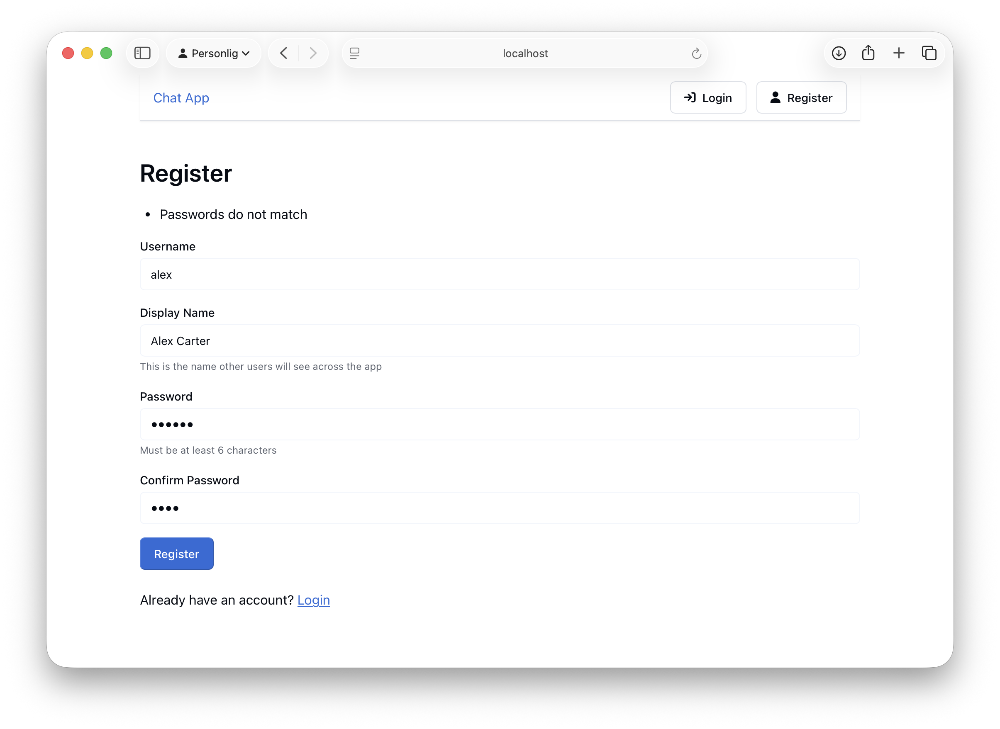
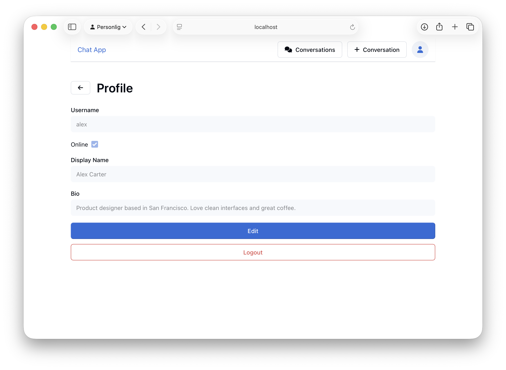
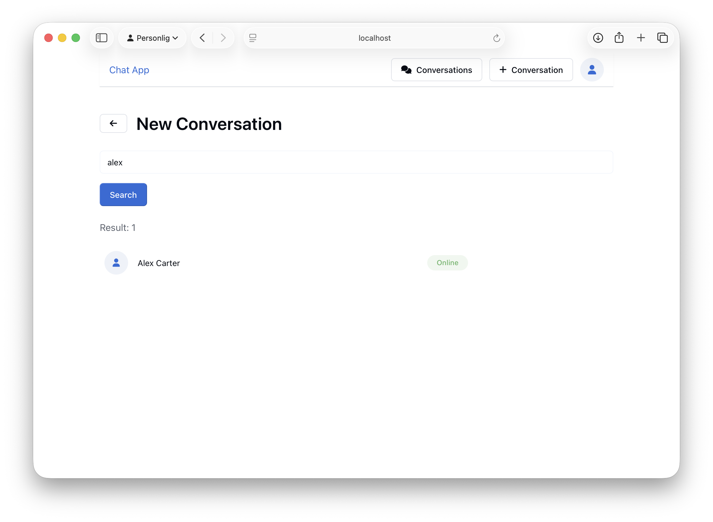
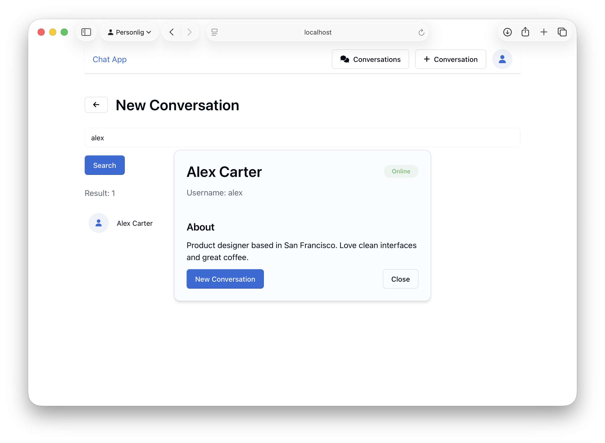
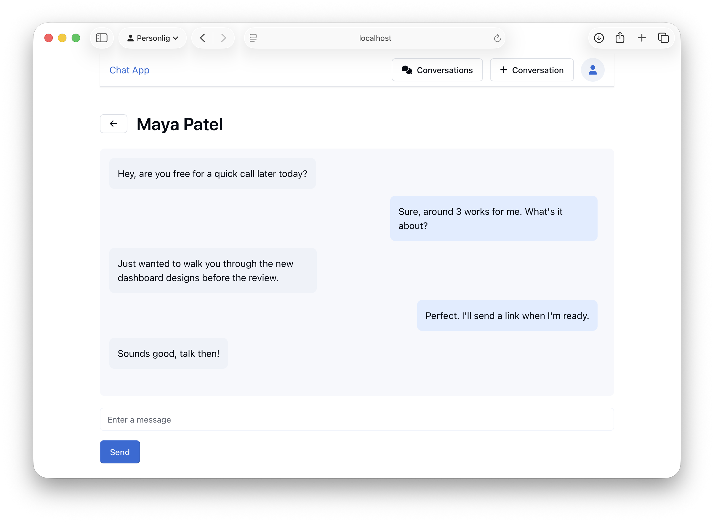

# Chat App — Client

React frontend for Chat App. This is the frontend part of the project. For the backend, see [chat-app-server](https://github.com/Jackan04/chat-app-server).

## Tech

- React.js
- Vite 
- oat.ink (CSS component library)

## Features

- Register and log in
- Browse users and start conversations
- Send and receive messages
- Edit your profile (display name, bio, online status)

## Screenshots







## Setup

**Requirements:** Node.js, a running instance of [chat-app-server](https://github.com/Jackan04/chat-app-server)

```bash
git clone https://github.com/Jackan04/chat-app
cd chat-app
npm install
```
Start the dev server:

```bash
npm run dev
```

The client proxies `/api` requests to `http://localhost:3000` by default. If your server runs on a different port, update `vite.config.js` accordingly.
